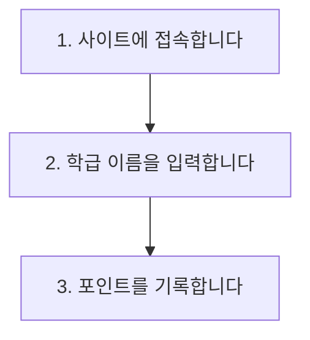

# 사용법 섹션을 Mermaid 흐름도로

README 작성 도구의 "사용법(How to Use)"을 자유 입력 텍스트 대신 **단계 카드** 입력으로 바꾸고, Mermaid 흐름도 코드 블록으로 출력합니다. GitHub와 미리보기에서 도형 흐름도로 보입니다.

## 화면 변경

"배포 주소 및 사용법" 카드의 사용법 입력이 단계 목록으로 바뀝니다.

- 기본 3개 단계 입력칸 (한 줄 입력, 각 60자 제한)
- "단계 추가" 버튼 / 각 줄 삭제 버튼 (기능 항목과 동일한 UI)
- 모든 단계가 비어 있으면 사용법 섹션 자체가 생략됨

## 생성되는 마크다운

```text
## 📖 사용법 (How to Use)


```

- 단계가 5개를 넘으면 세로 흐름(TD)을 유지해 길어져도 읽기 쉽게 둡니다.
- 큰따옴표, 대괄호 등 Mermaid에서 문제가 되는 문자는 자동으로 안전하게 치환합니다.

## 미리보기

미리보기에서도 도형으로 보이도록 mermaid 렌더링을 붙입니다. 다만 mermaid는 브라우저 전용·용량이 큰 라이브러리라 다음 조건을 지킵니다.

- README 페이지에 들어왔을 때만 로드(다른 페이지 초기 로딩에 영향 없음)
- 서버 렌더링 단계에서는 실행하지 않음
- 렌더링에 실패하면 원래 코드 블록을 그대로 표시
- 타이핑 중에는 약간의 지연(0.3초) 후에 도형을 다시 그려 버벅임 방지

## 안전 장치

- 이미 브라우저에 저장된 기존 입력값(구버전 `사용법` 텍스트)이 있어도 오류 없이 열리도록, 줄 단위로 쪼개 단계 목록으로 1회 변환합니다. 값이 없으면 빈 3칸으로 보정합니다.
- 서버·데이터베이스 호출은 없고 전부 브라우저 안에서 동작하므로 서버 비용 증가나 다른 기능 영향은 없습니다.

## 기술 메모

- `src/lib/readme-template.ts`: `usage: string` → `usageSteps: string[]`. 빈 항목 제거 후 `flowchart TD` 블록 생성, 노드 라벨은 `"` → `'`, 대괄호·개행 정제.
- `src/routes/_main.readme.tsx`: Textarea → 단계 카드 입력(추가/삭제). localStorage 병합 후 `Array.isArray(usageSteps)`가 아니면 legacy `usage`를 `split("\n")`으로 마이그레이션, 그것도 없으면 `["","",""]`.
- 미리보기: `mermaid` 신규 의존성. 정적 import 금지 — 별도 `MermaidBlock` 컴포넌트에서 `useEffect` 안 `await import("mermaid")`로 지연 로드(SSR 미실행). `mermaid.render`는 매번 고유 id(`useId` 기반 카운터) 사용, try/catch 폴백은 `<pre>` 원문. 다이어그램 소스 문자열이 바뀔 때만 300ms 디바운스로 재렌더.
- ReactMarkdown `components.code`에서 `language-mermaid` 감지해 `MermaidBlock`으로 위임(기존 `rehype-raw`/`remark-gfm` 설정 유지).
- `src/routes/_main.guide.tsx`: README 안내(약 531~532행) 사용법 문구를 "단계별 흐름도 자동 생성"으로 갱신.

