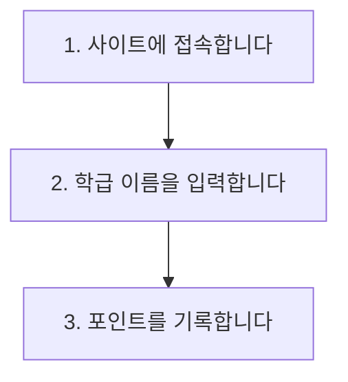

# 사용법 섹션을 Mermaid 흐름도로

README 작성 도구의 "사용법(How to Use)"을 자유 입력 텍스트 대신 **단계 카드** 입력으로 바꾸고, Mermaid 흐름도 코드 블록으로 출력합니다. GitHub와 미리보기에서 도형 흐름도로 보입니다.

## 화면 변경

"배포 주소 및 사용법" 카드의 사용법 입력이 단계 목록으로 바뀝니다.

- 기본 3개 단계 입력칸 (한 줄 입력, 각 60자 제한)
- "단계 추가" 버튼 / 각 줄 삭제 버튼 (기능 항목과 동일한 UI)
- 모든 단계가 비어 있으면 사용법 섹션 자체가 생략됨

## 생성되는 마크다운

```text
## 📖 사용법 (How to Use)


```

- 단계가 5개를 넘으면 세로 흐름(TD)을 유지해 길어져도 읽기 쉽게 둡니다.
- 큰따옴표, 대괄호 등 Mermaid에서 문제가 되는 문자는 자동으로 안전하게 치환합니다.

## 미리보기

README 미리보기 영역은 마크다운 렌더러를 쓰고 있어 mermaid 블록은 도형 대신 코드 블록으로 보입니다. 미리보기에서도 도형으로 보이도록 mermaid 렌더링을 붙입니다(코드 블록 요소를 감지해 다이어그램으로 그림). 렌더링 실패 시에는 원래 코드 블록을 그대로 보여줍니다.

## 기술 메모

- `src/lib/readme-template.ts`: `usage: string` → `usageSteps: string[]`. 빈 항목 제거 후 `flowchart TD` 블록 생성, 노드 라벨은 `"` → `'`, 개행 제거로 정제.
- `src/routes/_main.readme.tsx`: Textarea → 단계 카드 입력(추가/삭제). localStorage 병합 시 구버전 `usage` 문자열이 있으면 줄 단위로 쪼개 `usageSteps`로 1회 마이그레이션.
- 미리보기: `mermaid` 패키지 추가, ReactMarkdown `code` 커스텀 컴포넌트에서 `language-mermaid`를 감지해 `mermaid.render`로 SVG 삽입. 다크모드 테마 연동.
- `src/routes/_main.guide.tsx`: 사용법 항목 설명을 "단계별 흐름도 자동 생성"으로 갱신.
